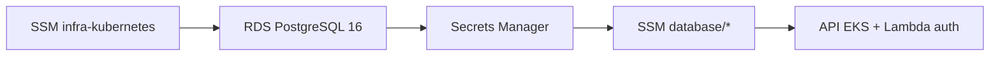
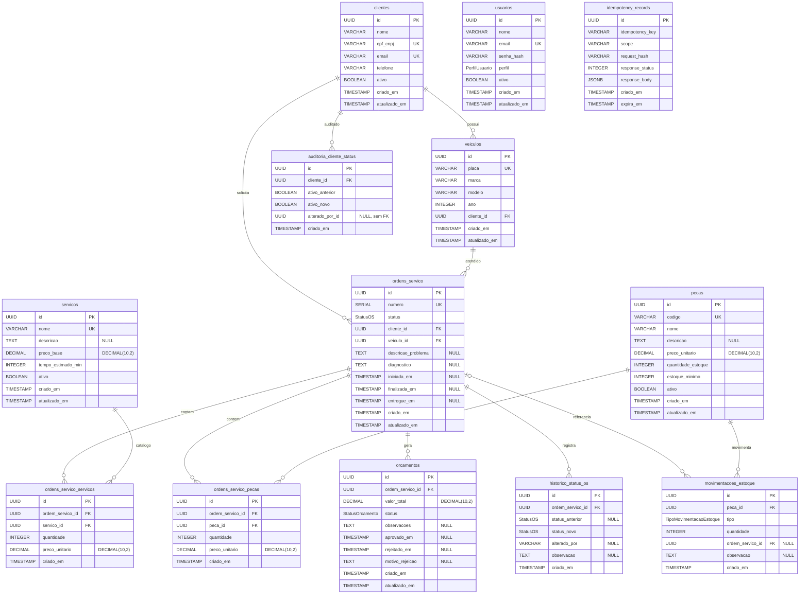

# tech-challenge-infra-database

Terraform do RDS PostgreSQL, security groups, Secrets Manager e exports SSM consumidos pela aplicação e pelas Functions.

## Propósito e limites

| Dentro deste repo                                          | Fora deste repo                                          |
| ---------------------------------------------------------- | -------------------------------------------------------- |
| RDS PostgreSQL 16, SG, Secrets Manager, alarmes CloudWatch | VPC/subnets → SSM de `tech-challenge-infra-kubernetes`   |
| Exports SSM `/tech-challenge/producao/database/*`          | Schema, migrations, seed demo → `tech-challenge-oficina` |

## Arquitetura



## Diagrama Entidade-Relacionamento (DER)



## Responsabilidade

| Recurso           | Descricao                                                      |
| ----------------- | -------------------------------------------------------------- |
| RDS PostgreSQL 16 | Banco gerenciado privado, criptografado (gp3), TLS obrigatorio |
| Parameter group   | `rds.force_ssl=1`, logs de conexao/DDL                         |
| Secrets Manager   | Credenciais — **nunca** expostas em output Terraform aberto    |
| Security Group    | Ingress 5432 apenas de Lambda e nodes EKS                      |
| CloudWatch        | Logs PostgreSQL + alarmes CPU/conexoes/storage                 |
| SSM               | Endpoint, porta, ARN do secret, SG do RDS                      |

Schema e migrations permanecem no projeto [`tech-challenge-oficina`](https://github.com/7feeh7/tech-challenge-oficina).

## Deploy ativo

SSM `/tech-challenge/producao/database/rds_endpoint`, `db_secret_arn` — sem exposição de senha em outputs Terraform.

## Tecnologias

- Terraform >= 1.5
- AWS RDS PostgreSQL 16 (`db.t3.micro`, 20 GB gp3)
- AWS Secrets Manager + SSM Parameter Store

## Estrutura do projeto

```
tech-challenge-infra-database/
├── terraform/
│   ├── main.tf                    # Provider, backend S3, tags
│   ├── variables.tf               # Variáveis
│   ├── terraform.tfvars.example   # Exemplo de tfvars
│   ├── data.tf                    # Lê SSM do infra-kubernetes
│   ├── rds.tf                     # Instância RDS PostgreSQL 16
│   ├── parameter_group.tf         # force_ssl + logs
│   ├── security-groups.tf         # Ingress 5432 (Lambda + EKS)
│   ├── secrets.tf                 # Secrets Manager
│   ├── ssm.tf                     # Exports SSM
│   ├── monitoring.tf              # Alarmes CloudWatch
│   └── outputs.tf                 # Outputs (sem senha)
├── .github/workflows/
│   ├── pr-validation.yml          # Validação em PRs (não toca AWS)
│   └── deploy.yml                 # Apply em main
├── docs/
│   └── backup-restore.md          # Backup, restore e troubleshooting
└── README.md
```

## Dependencias (contrato SSM)

Parametros consumidos de `tech-challenge-infra-kubernetes` em `/tech-challenge/producao/infra/*`:

| Parametro                    | Uso             |
| ---------------------------- | --------------- |
| `vpc_id`                     | SG do RDS       |
| `private_subnet_ids`         | DB subnet group |
| `lambda_security_group_id`   | Ingress 5432    |
| `eks_node_security_group_id` | Ingress 5432    |

Parametros **publicados** por este repo em `/tech-challenge/producao/database/*`:

| Parametro                                   | Consumidor                |
| ------------------------------------------- | ------------------------- |
| `rds_endpoint` / `rds_address` / `rds_port` | CI/CD, operacao           |
| `db_secret_arn`                             | API (deploy), Lambda auth |
| `db_name`                                   | Configuracao              |
| `rds_security_group_id`                     | Referencia cruzada        |

## Variaveis

| Variavel                 | Default       | Descricao                                         |
| ------------------------ | ------------- | ------------------------------------------------- |
| `environment`            | —             | `producao` (unico provisionado)                   |
| `db_instance_class`      | `db.t3.micro` | Porte da instancia (~87 conexoes max)             |
| `db_allocated_storage`   | `20`          | GB gp3 criptografado                              |
| `db_multi_az`            | `false`       | Single-AZ (ADR-003 — custo demo)                  |
| `db_skip_final_snapshot` | `true`        | Ignorado em producao (sempre gera snapshot final) |

Copie `terraform/terraform.tfvars.example` para `terraform.tfvars`.

## Deploy

```bash
cd terraform
terraform init
terraform plan   # apenas em main (CI) ou com credencial AWS
terraform apply
```

### Branches e pipelines

| Branch    | Workflow            | Toca AWS                                   |
| --------- | ------------------- | ------------------------------------------ |
| `develop` | `pr-validation.yml` | **nao** (fmt, validate, tfsec, trufflehog) |
| `main`    | `deploy.yml`        | **sim** (plan + apply + smoke SSM)         |

State key: `tech-challenge-infra-database/producao/terraform.tfstate`

## Outputs (sem segredos)

| Output          | Descricao                  |
| --------------- | -------------------------- |
| `rds_endpoint`  | host:porta                 |
| `rds_address`   | hostname                   |
| `db_secret_arn` | ARN Secrets Manager        |
| `ssm_prefix`    | `/tech-challenge/producao` |

Senha e connection string **somente** no Secrets Manager.

## Backup e restore

- Retencao: 7 dias, janela 03:00–04:00 UTC
- RPO ≤ 24 h, RTO ≤ 45 min
- Procedimento de teste de restauracao: [`docs/backup-restore.md`](docs/backup-restore.md)

## Acesso

- RDS **nao** e publicamente acessivel
- Conexao apenas de pods EKS e Lambda na VPC privada
- TLS obrigatorio (`rds.force_ssl=1`); app usa `DATABASE_SSL=true`

## Protecao contra exclusao

- `deletion_protection = true` em producao
- Snapshot final obrigatorio ao destruir instancia em producao
- Destroy manual via `workflow_dispatch` — nunca automatico em push

## GitHub Secrets

| Secret                                        | Uso                                |
| --------------------------------------------- | ---------------------------------- |
| `AWS_ACCESS_KEY_ID` / `AWS_SECRET_ACCESS_KEY` | Deploy                             |
| `TF_STATE_BUCKET`                             | Backend S3                         |
| `TF_STATE_LOCK_TABLE`                         | Lock DynamoDB                      |
| `JWT_SECRET`                                  | Atualiza env da Lambda apos deploy |

## Rollback

Reverta o commit e merge em `main`, ou `workflow_dispatch` → destroy (manual).

## Troubleshooting

Ver [`docs/backup-restore.md`](docs/backup-restore.md#troubleshooting).


