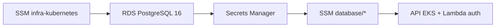

# tech-challenge-infra-database

Terraform do RDS PostgreSQL, security groups, Secrets Manager e exports SSM consumidos pela aplicação e pelas Functions.

## Propósito e limites

| Dentro deste repo | Fora deste repo |
| --- | --- |
| RDS PostgreSQL 16, SG, Secrets Manager, alarmes CloudWatch | VPC/subnets → SSM de `tech-challenge-infra-kubernetes` |
| Exports SSM `/tech-challenge/producao/database/*` | Schema, migrations, seed demo → `tech-challenge-oficina` |

## Dockerfile

**Não aplicável.** Repositório somente Terraform — o serviço de banco é RDS gerenciado pela AWS.

## Arquitetura (este repositório)



Visão completa: [componentes-nuvem](https://github.com/7feeh7/tech-challenge-oficina/blob/main/docs/diagramas/componentes-nuvem.md) · Banco: [docs/banco](https://github.com/7feeh7/tech-challenge-oficina/tree/main/docs/banco) · ER: [modelo-relacional-er](https://github.com/7feeh7/tech-challenge-oficina/blob/main/docs/diagramas/modelo-relacional-er.md)

> **Ambiente unico (001-R1):** apenas `producao` e provisionado. `develop` valida sem credencial AWS.

## Responsabilidade

| Recurso | Descricao |
| --- | --- |
| RDS PostgreSQL 16 | Banco gerenciado privado, criptografado (gp3), TLS obrigatorio |
| Parameter group | `rds.force_ssl=1`, logs de conexao/DDL |
| Secrets Manager | Credenciais — **nunca** expostas em output Terraform aberto |
| Security Group | Ingress 5432 apenas de Lambda e nodes EKS |
| CloudWatch | Logs PostgreSQL + alarmes CPU/conexoes/storage |
| SSM | Endpoint, porta, ARN do secret, SG do RDS |

Schema e migrations permanecem em [`tech-challenge-oficina/prisma/`](https://github.com/7feeh7/tech-challenge-oficina/tree/main/prisma).

## Repositórios relacionados

| Repositório | URL | Papel |
| --- | --- | --- |
| tech-challenge-infra-kubernetes | https://github.com/7feeh7/tech-challenge-infra-kubernetes | **Deploy 1º** — VPC e SSM infra |
| **tech-challenge-infra-database** (este) | https://github.com/7feeh7/tech-challenge-infra-database | **Deploy 2º** — RDS |
| tech-challenge-serverless | https://github.com/7feeh7/tech-challenge-serverless | Deploy 3º — consome `db_secret_arn` |
| tech-challenge-oficina | https://github.com/7feeh7/tech-challenge-oficina | Deploy 4º — migrations + API |

## Swagger / OpenAPI

**Não aplicável.** API documentada em [tech-challenge-oficina/docs/openapi.json](https://github.com/7feeh7/tech-challenge-oficina/blob/main/docs/openapi.json).

## Deploy ativo

SSM `/tech-challenge/producao/database/rds_endpoint`, `db_secret_arn` — sem exposição de senha em outputs Terraform.

## Tecnologias

- Terraform >= 1.5
- AWS RDS PostgreSQL 16 (`db.t3.micro`, 20 GB gp3)
- AWS Secrets Manager + SSM Parameter Store

## Dependencias (contrato SSM)

Parametros consumidos de `tech-challenge-infra-kubernetes` em `/tech-challenge/producao/infra/*`:

| Parametro | Uso |
| --- | --- |
| `vpc_id` | SG do RDS |
| `private_subnet_ids` | DB subnet group |
| `lambda_security_group_id` | Ingress 5432 |
| `eks_node_security_group_id` | Ingress 5432 |

Parametros **publicados** por este repo em `/tech-challenge/producao/database/*`:

| Parametro | Consumidor |
| --- | --- |
| `rds_endpoint` / `rds_address` / `rds_port` | CI/CD, operacao |
| `db_secret_arn` | API (deploy), Lambda auth |
| `db_name` | Configuracao |
| `rds_security_group_id` | Referencia cruzada |

Contrato completo: [`../tech-challenge-infra-kubernetes/docs/contratos-cross-repo.md`](../tech-challenge-infra-kubernetes/docs/contratos-cross-repo.md)

## Variaveis

| Variavel | Default | Descricao |
| --- | --- | --- |
| `environment` | — | `producao` (unico provisionado) |
| `db_instance_class` | `db.t3.micro` | Porte da instancia (~87 conexoes max) |
| `db_allocated_storage` | `20` | GB gp3 criptografado |
| `db_multi_az` | `false` | Single-AZ (ADR-003 — custo demo) |
| `db_skip_final_snapshot` | `true` | Ignorado em producao (sempre gera snapshot final) |

Copie `terraform/terraform.tfvars.example` para `terraform.tfvars`.

## Deploy

```bash
cd terraform
terraform init
terraform plan   # apenas em main (CI) ou com credencial AWS
terraform apply
```

### Branches e pipelines

| Branch | Workflow | Toca AWS |
| --- | --- | --- |
| `develop` | `pr-validation.yml` | **nao** (fmt, validate, tfsec, trufflehog) |
| `main` | `deploy.yml` | **sim** (plan + apply + smoke SSM) |

State key: `tech-challenge-infra-database/producao/terraform.tfstate`

## Outputs (sem segredos)

| Output | Descricao |
| --- | --- |
| `rds_endpoint` | host:porta |
| `rds_address` | hostname |
| `db_secret_arn` | ARN Secrets Manager |
| `ssm_prefix` | `/tech-challenge/producao` |

Senha e connection string **somente** no Secrets Manager.

## Backup e restore

- Retencao: 7 dias, janela 03:00–04:00 UTC
- RPO ≤ 24 h, RTO ≤ 45 min
- Procedimento de teste de restauracao: [`docs/backup-restore.md`](docs/backup-restore.md)

## Acesso

- RDS **nao** e publicamente acessivel
- Conexao apenas de pods EKS e Lambda na VPC privada
- TLS obrigatorio (`rds.force_ssl=1`); app usa `DATABASE_SSL=true`

## Protecao contra exclusao

- `deletion_protection = true` em producao
- Snapshot final obrigatorio ao destruir instancia em producao
- Destroy manual via `workflow_dispatch` — nunca automatico em push

## GitHub Secrets (Environment `producao`)

| Secret | Uso |
| --- | --- |
| `AWS_ACCESS_KEY_ID` / `AWS_SECRET_ACCESS_KEY` | Deploy |
| `TF_STATE_BUCKET` | Backend S3 |
| `TF_STATE_LOCK_TABLE` | Lock DynamoDB |
| `JWT_SECRET` | Atualiza env da Lambda apos deploy |

## Rollback

Reverta o commit e merge em `main`, ou `workflow_dispatch` → destroy (manual).

## Troubleshooting

Ver [`docs/backup-restore.md`](docs/backup-restore.md#troubleshooting).
